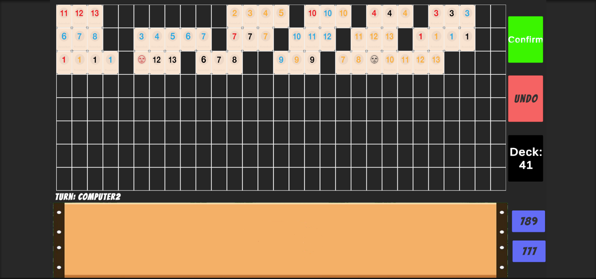
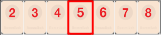

# Rummikub — Unity

🌐 **Project page:** [grloper.github.io/Rummikub-Master-Unity](https://grloper.github.io/Rummikub-Master-Unity/)
🎮 **Play in your browser:** [grloper.github.io/Rummikub-Master-Unity/play/](https://grloper.github.io/Rummikub-Master-Unity/play/) — vs the AI, local pass-and-play, or a **real online room** with friends over peer-to-peer WebRTC (no server needed)

A complete, playable **Rummikub** board game built in **Unity 6** with drag-and-drop tiles, full rule
enforcement, undo support, and a rule-based computer opponent — **no minimax, no brute force**.
Every board manipulation (placing, extending, merging, splitting sets) is resolved through a
hash-table + doubly-linked-list design that keeps tile placement at **O(1)** for every
edge-connection scenario.



## Features

- 🎮 **Full Rummikub rules** — runs, groups, jokers, the 30-point initial meld, win detection
- 🖱️ **Drag & drop play** — grab tiles from your rack and drop them anywhere legal on the 8×29 board
- ↩️ **Undo system** — every move in a turn is tracked on a stack; one click rolls the board back to the last confirmed state
- 🤖 **Computer opponent** — a layered, deterministic AI that plays full sets, completes partial sets by *stealing* spare tiles from board sets, appends loose tiles, and performs multi-step **chain extractions** (including freeing jokers from board sets) — looping until no move remains
- 🃏 **Smart board maintenance** — sets automatically merge when you bridge them and split when you pull a tile from the middle, with the data structures updated in place
- 🔢 **One-click hand sorting** — arrange your rack by runs (`789`) or by groups (`777`)
- ⚡ **O(1) placement engine** — no board rescans; see [Architecture](#architecture--the-o1-placement-engine)

## How to Play

| Action | How |
|---|---|
| Place a tile | Drag it from your rack onto an empty board slot |
| Extend / merge sets | Drop a tile directly next to an existing set |
| Rearrange the board | Drag tiles between board slots (only once your initial meld is down) |
| Confirm your turn | **Confirm** — validates every set on the board first |
| Take back your moves | **UNDO** — restores the board to the start of your turn |
| Skip / draw | Click the **Deck** — draws a tile and passes the turn |

**Rules recap:** each player starts with 14 tiles. A *run* is 3+ consecutive numbers in one color; a
*group* is 3–4 tiles of the same number in different colors. Your first meld must total at least 30
points from your own rack. Jokers substitute for any tile. First player to empty their rack wins.

## Architecture — the O(1) placement engine

Instead of searching the board for the set a tile belongs to (or re-validating the whole board on
every drop), the game models the board with two hash tables and a custom doubly linked list:

```
cardToSetPos : Dictionary<int, SetPosition>      // key = row * 100 + column  →  set id
validSets    : Dictionary<SetPosition, CardsSet> // set id  →  the actual set
CardsSet     : DoublyLinkedList<Card>            // O(1) add/remove at both ends, O(1) append
```

**Only the two edge tiles of every set are keyed** in `cardToSetPos`. When a tile is dropped at
`(row, col)`, the engine hashes its two horizontal neighbors (`key ± 1`) and lands in exactly one of
four O(1) scenarios:

| Scenario | Neighbor keys found | Work done |
|---|---|---|
| New set | none | create set, key the tile |
| Extend left edge | right only | prepend to linked list, move the edge key |
| Extend right edge | left only | append to linked list, move the edge key |
| **Merge two sets** | both | append one linked list to the other — O(1) — re-key edges |

Pulling a tile back off a set is the mirror image: edge tiles detach in O(1), while pulling from the
**middle** splits the linked list into two sets (O(k) for the k tiles that change set identity —
the theoretical minimum, since each of them must be re-labeled).



Supporting structures keep the rest of the game at the same standard:

- **`PlayerHand`** — a 4×14 matrix of buckets (color × rank): O(1) add/remove/contains, and
  run-sorted or group-sorted traversal in O(n) by walking the matrix in the right order (a counting
  sort, effectively).
- **Undo** — a move stack plus a deep-copied board snapshot taken at each confirmed turn: undo is
  O(moves), not O(board).
- **Set validation** — `IsRun` / `IsGroupOfColors` walk a single set once (with joker handling),
  and only when a turn is confirmed.

### The computer opponent

The AI never searches a game tree. Each turn it runs a pipeline of constructive strategies over the
hand and board structures, repeating until it reaches a fixpoint:

1. **Drop complete sets** — extracts maximal valid runs/groups from the sorted hand in O(n)
2. **Complete partial sets** — finds 2-tile partials in hand, then *steals* a spare tile from a
   4-tile group or a long run on the board without invalidating it
3. **Append loose tiles** — attaches single tiles to set edges, or splits a long run down the
   middle to squeeze a tile in
4. **Chain extractions** — multi-step plans: free a joker from a board set by replacing it,
   combine one hand tile with two extractable board tiles, or add a 4th color to a group so one of
   its tiles becomes extractable

Every candidate plan is re-validated against the live board before execution, and the shared
move stack keeps even AI moves undo-consistent.

## Project Structure

```
Assets/Scripts/
├── CardScripts/
│   ├── Card.cs               # Tile data (number, color, board position)
│   ├── CardPosition.cs       # Row/column ↔ slot-index conversions
│   ├── DoublyLinkedList.cs   # Custom list: O(1) ends, O(1) append, hashed Contains
│   ├── Node.cs               # List node
│   ├── PlayerHand.cs         # 4×14 bucket matrix — O(1) ops, O(n) sorted walks
│   └── SetPosition.cs        # Value-equal set identifier
├── DeckSetsClasses/
│   ├── CardsSet.cs           # A board set: run/group validation, combine/split
│   ├── PartialCardSet.cs     # 2-tile building blocks for the AI
│   ├── RummikubDeck.cs       # 106-tile deck (2 × 4 colors × 13 ranks + 2 jokers)
│   └── ICardSet.cs
├── GameManagerScripts/
│   ├── Board.cs              # The two hash tables + key maintenance
│   ├── GameBoard.cs          # Placement engine: extend / merge / split / undo
│   ├── GameController.cs     # Turn flow and win detection
│   ├── UImanager.cs          # Tile instantiation, sorting, confirm/undo buttons
│   ├── CardInfo.cs           # Extraction descriptor used by the AI
│   └── Constants.cs
├── Players/
│   ├── Player.cs             # Hand management, drawing, initial-meld state
│   ├── Human.cs / Computer.cs# Human input vs. AI pipeline
│   ├── ChainExtractor.cs     # Multi-step extraction planning for the AI
│   └── PlayerType.cs
└── UIHandler/
    ├── Draggableitem.cs      # Drag lifecycle for tiles
    └── TileSlot.cs           # Drop target: routes drops into the placement engine
```

## Getting Started

1. **Requirements:** Unity **6000.4** (Unity 6) or newer.
2. Clone the repo:
   ```bash
   git clone https://github.com/grloper/Rummikub-Master-Unity.git
   ```
3. Open the project in Unity Hub and load `Assets/Scenes/SampleScene.unity`.
4. Press **Play**. Player order is randomized; the mix of human/computer players can be changed on
   the Player objects in the Inspector.

## Design Notes

- The board is a plain 232-slot grid (8×29) of UI slots; all game logic lives in the hash-table
  layer, so the visual layer never has to be searched.
- Set ids (`SetPosition`) compare by value, which lets the undo system deep-copy the board
  dictionaries safely while sets keep their identity.
- Exceptions (`EmptyDeckException`, `UndoException`) are used at the API boundary of the deck and
  undo stack; game flow handles them where they occur.
- **Verbose diagnostics** (per-move board dumps, AI planning traces) are compiled out of the game
  entirely — including argument evaluation — unless you add `RUMMIKUB_VERBOSE` to
  *Project Settings → Player → Scripting Define Symbols* (see `GameLog.cs`).
- House rule: a joker counts as its printed 15 points toward the 30-point initial meld, rather
  than the value of the tile it represents.
