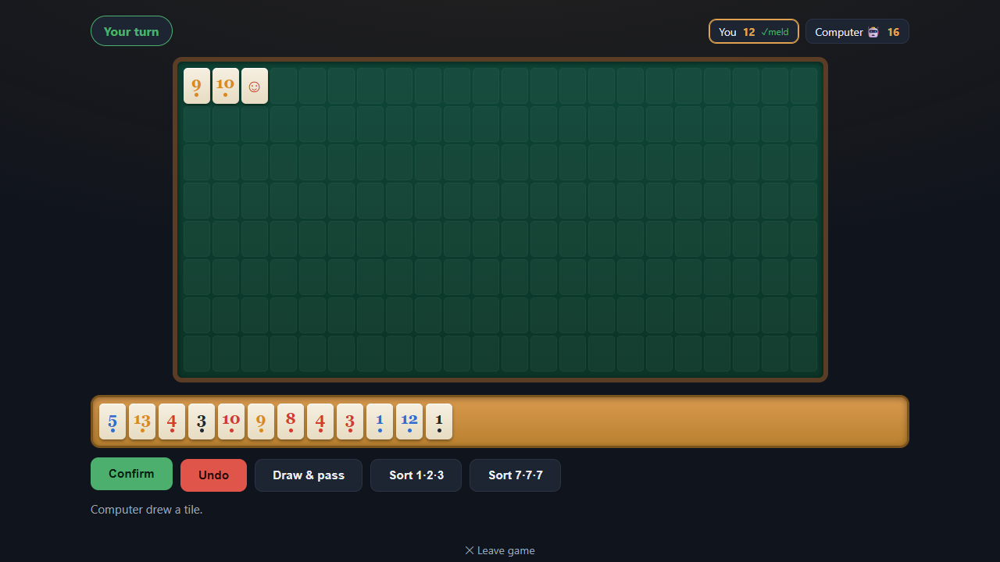

# Rummikub Lab

A tile-game engineering project with a Unity engine and a **separate JavaScript browser adaptation**. The browser game is not a Unity WebGL export and does not run the Unity AI.

[Play the browser adaptation](https://grloper.github.io/Rummikub-Master-Unity/play/) · [Project page](https://grloper.github.io/Rummikub-Master-Unity/) · [Verification record](docs/VERIFICATION.md)

## Two implementations

| | Unity source | Browser adaptation |
|---|---|---|
| Entry | `Assets/Scenes/SampleScene.unity` | `docs/play/index.html` |
| Board | 8 × 29 | 8 × 22 |
| Opponent | `Computer.cs` and `ChainExtractor.cs`: layered full-set, partial-set, append and chain-extraction logic | `ai.js`: greedy runs, groups and edge appends |
| Rules | `CardsSet.cs`, `GameBoard.cs` and player turn logic | `game.js` validates runs/groups and opening melds |
| Evidence | Core C# classes checked using explicit Unity adapters; editor scene run blocked by licensing | Real Chrome session: deal, sorting, rejected empty confirm, draw/pass, computer response, undo and a committed 30-point opening meld |

Neither opponent is an optimal solver. These checks do not establish every published rule or network scenario.

## Run locally

```sh
python -m http.server 8755 --bind 127.0.0.1 --directory docs
```

Open `http://127.0.0.1:8755/play/`. Computer mode and pass-and-play are implemented locally. Online rooms use PeerJS public signaling and WebRTC; they require network access and were not tested across devices. Room privacy and server-free connectivity are not established.

For Unity, use the editor in `ProjectSettings/ProjectVersion.txt` (6000.4.0f1), open the project and load `Assets/Scenes/SampleScene.unity`. A valid Unity license and package resolution are required. Scene lifecycle, serialization and drag/drop need an editor play test before declaring that app verified.

## Repeatable checks

Requires Node 22+ and .NET 9:

```sh
node --test tests/browser-rules.test.cjs
dotnet run --project tests/core/CoreChecks.csproj
```

Browser checks cover malformed boards, duplicate physical IDs, runs/jokers, crowded-board opening melds, duplicate ranks, 400 seeded AI racks and 50 two-player simulations. The C# harness links actual production card, set, list and deck files using small Unity adapters. It does **not** simulate Unity scenes or the AI coroutine.

## Improvements

- Browser opening melds roll back when only part of the planned 30-point move fits.
- Duplicate ranks no longer hide a valid greedy run; invalid/duplicate tile IDs and malformed boards are rejected.
- Unity set probes reject already-present tiles, preserving the membership index.
- CI runs both rule harnesses; documentation separates observed behavior from source-only features.

The Unity engine indexes set edges and stores connected tiles in doubly linked lists. Edge lookup and pointer splicing are constant-time; membership unions and appended-tile identity updates are O(m). Whole-board validation and set traversal add work. No measured benchmark supports universal O(1) placement.

## Demo evidence



Actual local Chrome capture, not Unity gameplay or online multiplayer evidence. Existing Unity images remain historical assets with unverified provenance. See [verification](docs/VERIFICATION.md) for limits.
